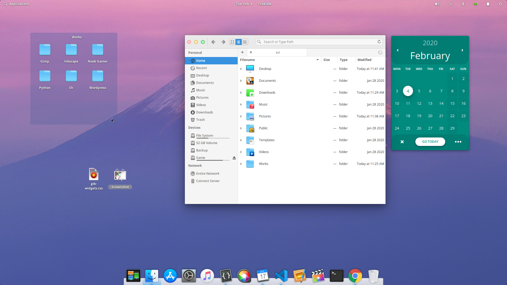

# eOS-x (beta)
A light theme for elementary OS.

Since my favorite theme OSe-Light (https://www.deviantart.com/wefunkster/art/OSe-Light-Xtrlght-GTK-themes-for-elementary-OS-694065OSe-Light854) 
no longer compatible with recent version of elementary os, I made one for myself :)
It still in beta. So you may find some inconsistencies.

### Installation
1. Open terminal and execute the following

```
git clone https://github.com/avikhandakar/eOS-x.git ~/.themes/eOS-x
```
2. Select this theme in elementary tweak or execute the following

```
gsettings set org.gnome.desktop.interface gtk-theme "eOS-x"
```
### Screenshot



Love this theme? Why not buy me a coffee? https://www.paypal.com/paypalme2/avikhandakar
